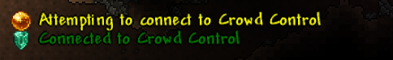

</src>

A mod, for streamers, which allows viewers to spend money on in-game effects via the [Crowd Control](https://crowdcontrol.live/) Twitch extension.

- Effects and prices can be customised through the Crowd Control application.
- Built for Terraria 1.4: Journey's End.
- Supports single-player **and** multi-player.
- Integrates with Calamity mod.
- Friendly towards newer Terraria players - your viewers can provide helpful effects.
- A fun way to earn revenue and grow your community!

## Effects

The mod features a wide variety of effects. It's up to the viewers whether they want to help you on your Terraria quest, or try to set you back as much as possible. 
Here is just a taste of the effects that this mod has to offer:

- Explode the player
- Spawn bosses
- Enable 'god-mode'
- Reforge weapons and tools
- Drop the player's items
- Drastically increase the spawn-rate
- Provide buffs and de-buffs
- Toggle "For the Worthy" and "Don't Starve" mode
- Increase movement speed and jump-height
- Flip the screen
- Spawn traps
- Provide weapons, armour & tools
- Change the weather
- Heal the player
- Hurt the player
- Summon a giant wall of fish
- Challenge the player to complete a goal within a short time

Listed are just a few of the effects available. A full list can be viewed in the Crowd Control application where you can also edit the pricing per effect.
Alternatively, those that are comfortable reading a little bit of code can view a full list of effects in [TerrariaPack.cs](https://github.com/DavidF-Dev/Terraria-Crowd-Control/blob/main/TerrariaPack.cs).

## Usage

Firstly, the mod requires [tModLoader](https://tmodloader.net/) for Terraria 1.4, which can be downloaded for free on Steam. 
Older versions are not supported.  
</src>  
The mod can be installed in a few ways:

- [Steam Workshop](https://steamcommunity.com/sharedfiles/filedetails/?id=2833108684) **(recommended)**
- tModLoader in-game Mod Browser: search for, and download `Crowd Control for Terraria`
- GitHub [Releases](https://github.com/DavidF-Dev/Terraria-Crowd-Control/releases): place the `.tmod` file
  in `Documents/My Games/Terraria/tModLoader/Mods`

### Starting Crowd Control
To begin playing, simply join a single-player or multi-player world (*the server must also have the mod installed*).
Upon entering the world, the mod will begin attempting to connect to the Crowd Control application.
Ensure that you have the application set up and running correctly by following [this guide](https://crowdcontrol.live/setup).
  
</src>
  
You will be notified via the in-game chat when the mod successfully connects to the Crowd Control application. At this point, your viewers can begin affecting your game through the Crowd Control Twitch extension!

### Configuration

The effects and prices can be configured through the Crowd Control application, however the mod also offers additional options through the in-game configuration menu. 
A few to highlight include:

- Disable effect messages in chat. This is useful if you would like to use the Crowd Control Browser Source.
- Display anonymous viewer names in chat.
- Alter the respawn time, so that you can get back into the gameplay sooner after dying.
- Enable spawn protection. Useful in stopping your spawn point from becoming a massive crater.
- Disable tombstones, so that you're world does not become one big graveyard.
- Enable the ability to teleport to other players in multi-player freely (or with a cooldown).

## Contact & Support

If you have any questions or would like to get in contact, shoot me an email at `contact@davidfdev.com`. 
Alternatively, you can send me a direct message on Twitter at [@DavidF_Dev](https://twitter.com/DavidF_Dev).  
For support with the Crowd Control application or Twitch extension, head over to the [forums](https://forum.warp.world/c/crowdcontrol) or join the [Discord](https://discord.warp.world/) server.
